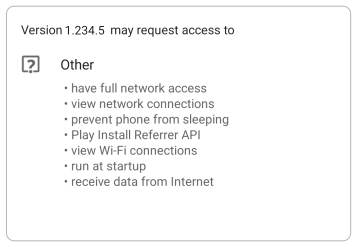
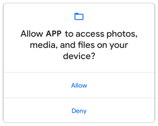

---
layout:
  title:
    visible: true
  description:
    visible: true
  tableOfContents:
    visible: true
  outline:
    visible: true
  pagination:
    visible: false
---

# ⛔ Permissões Android

As permissões do app ajudam a apoiar a privacidade do usuário protegendo o seguinte:

* **Dados restritos**, como o estado do sistema e os dados de contato dos usuários.
* **Ações restritas**, como a conexão a um dispositivo pareado e a gravação de áudio.

Esta página apresenta uma visão geral de como as permissões do Android funcionam, incluindo um fluxo de trabalho de alto nível para usar permissões, descrições de diferentes tipos de permissão e algumas práticas recomendadas para o uso de permissões no app. Outras páginas explicam como [minimizar as solicitações de permissão do app](https://developer.android.com/training/permissions/evaluating?hl=pt-br), [declarar permissões](https://developer.android.com/training/permissions/declaring?hl=pt-br), [solicitar permissões de execução](https://developer.android.com/training/permissions/requesting?hl=pt-br) e [restringir a forma como outros apps podem interagir](https://developer.android.com/training/permissions/restrict-interactions?hl=pt-br) com os componentes do seu.

Para conferir uma lista completa de permissões do app Android, acesse a [página de referência da API de permissões](https://developer.android.com/reference/android/Manifest.permission?hl=pt-br).

Para conferir alguns apps de exemplo que demonstram o fluxo de trabalho de permissões, acesse o [repositório de exemplos de permissão do Android](https://github.com/android/platform-samples/tree/main/samples/privacy/permissions) (link em inglês) no GitHub.

### Fluxo de trabalho para usar permissões 

Caso seu app ofereça funcionalidade que exija acesso a dados restritos ou ações restritas, determine se você pode receber as informações ou executar as ações [sem precisar declarar permissões](https://developer.android.com/training/permissions/evaluating?hl=pt-br). Você pode atender a muitos casos de uso no seu app, como tirar fotos, pausar a reprodução de mídia e exibir anúncios relevantes, sem precisar declarar nenhuma permissão.

Se você decidir que seu app precisa acessar dados restritos ou realizar ações restritas para atender a um caso de uso, declare as permissões apropriadas. Algumas permissões, conhecidas como [permissões no momento da instalação](https://developer.android.com/guide/topics/permissions/overview?hl=pt-br#install-time), são concedidas automaticamente quando o app é instalado. Outras permissões, conhecidas como [permissões de execução](https://developer.android.com/guide/topics/permissions/overview?hl=pt-br#runtime), exigem que seu app solicite a permissão no momento da execução.

A figura 1 ilustra o fluxo de trabalho para usar permissões de aplicativo:

<figure><figcaption></figcaption></figure>

### Tipos de permissões 

O Android categoriza as permissões por tipo, incluindo permissões no momento da instalação, de execução e permissões especiais. Cada tipo de permissão indica o escopo de dados restritos que seu app pode acessar e o escopo de ações restritas que ele pode realizar quando o sistema concede essa permissão. O nível de proteção de cada permissão é baseado no tipo e é mostrado na página de [referência da API de permissões](https://developer.android.com/reference/android/Manifest.permission?hl=pt-br).

#### Permissões da instalação 

As permissões de instalação dão ao app acesso limitado a dados restritos ou permitem que o app execute ações restritas que afetam minimamente o sistema ou outros apps. Quando você declara as permissões de instalação, a app store mostra um aviso de permissões sempre que o usuário visualiza a página de detalhes de um app, como mostrado na Figura 2. O sistema concede as permissões automaticamente ao app quando o usuário o instala.

O Android inclui vários subtipos de permissões no momento da instalação, incluindo permissões normais e de assinatura.

<figure><figcaption></figcaption></figure>

**Permissões normais**

Essas permissões autorizam o acesso a dados e ações que vão além do sandbox do seu app, mas apresentam muito pouco risco à privacidade do usuário e à operação de outros apps.

O sistema atribui o nível de proteção `normal` às permissões normais.

**Permissões de assinatura**

O sistema concede uma permissão de assinatura a um app apenas quando ele é assinado pelo mesmo certificado do app ou do SO que define a permissão.

Os aplicativos que implementam serviços privilegiados, como preenchimento automático ou serviços de VPN, também usam permissões de assinatura. Esses apps exigem permissões de assinatura de vinculação de serviço para que somente o sistema possa se vincular aos serviços.

**Observação**: algumas permissões de assinatura não podem ser usadas por apps de terceiros.

O sistema atribui o nível de proteção `signature` às permissões de assinatura.

#### Permissões de execução 

Permissões de execução, também conhecidas como "permissões perigosas", dão ao seu app acesso extra a dados restritos ou autorizam que ele execute ações restritas que afetam mais significativamente o sistema e outros apps. Portanto, você precisa [solicitar permissões de execução](https://developer.android.com/training/permissions/requesting?hl=pt-br) no app antes de acessar os dados restritos ou realizar ações restritas. Não suponha que essas permissões já tenham sido concedidas anteriormente. Verifique e, se necessário, faça a solicitação delas antes de cada acesso.

Quando seu app solicita uma dessas permissões, o sistema mostra uma solicitação de permissão de execução, como na Figura 3.

Muitas permissões de execução acessam _dados particulares do usuário_, um tipo especial de dado restrito que inclui informações potencialmente confidenciais. Exemplos de dados particulares do usuário incluem localização e informações de contato.

O microfone e a câmera oferecem acesso a informações confidenciais. Portanto, o sistema ajuda você a [explicar por que seu app acessa essas informações](https://developer.android.com/training/permissions/explaining-access?hl=pt-br).

<figure><figcaption></figcaption></figure>

O sistema atribui o nível de proteção `dangerous` às permissões de execução.

#### Permissões especiais 

Permissões especiais correspondem a operações de app específicas. Somente a plataforma e os OEMs podem definir permissões especiais. Além disso, a plataforma e os OEMs geralmente definem permissões especiais quando querem proteger o acesso a ações significativas, como sobrepor outros apps.

A página **Acesso especial para apps** nas configurações do sistema contém um conjunto de operações ativadas pelo usuário. Muitas dessas operações são implementadas como permissões especiais.

Saiba mais sobre como [solicitar permissões especiais](https://developer.android.com/training/permissions/requesting-special?hl=pt-br).

O sistema atribui o nível de proteção `appop` às permissões especiais.

#### Grupos de permissões 

As permissões podem pertencer a [grupos de permissões](https://developer.android.com/guide/topics/manifest/permission-group-element.html?hl=pt-br). Eles consistem em um conjunto de permissões logicamente relacionadas. Por exemplo, as permissões para enviar e receber mensagens SMS podem pertencer ao mesmo grupo, já que ambas estão relacionadas à interação do aplicativo com SMS.

Os grupos de permissões ajudam o sistema a minimizar o número de caixas de diálogo mostradas ao usuário quando um app solicita permissões relacionadas. Quando um usuário recebe uma solicitação para conceder permissões a um aplicativo, as permissões que pertencem ao mesmo grupo são apresentadas na mesma interface. No entanto, as permissões podem mudar de grupo sem aviso, então não presuma que uma permissão específica está agrupada com qualquer outra.

### Práticas recomendadas 

As permissões do app são criadas com base em [recursos de segurança do sistema](https://source.android.com/security/features?hl=pt-br) e ajudam o Android a alcançar estas metas relacionadas à privacidade do usuário:

* **Controle**: o usuário tem controle sobre os dados que compartilha com apps.
* **Transparência**: o usuário entende quais dados um app usa e o motivo do acesso a esses dados.
* **Minimização de dados**: um app acessa e usa apenas os dados necessários para uma tarefa ou ação específica que o usuário invoca.

Esta seção apresenta práticas recomendadas para usar permissões no app. Acesse a página sobre [práticas recomendadas de permissões do app](https://developer.android.com/training/permissions/usage-notes?hl=pt-br) para saber como trabalhar com elas no Android.

#### Solicitar um número mínimo de permissões 

Quando o usuário solicita uma ação específica, o app deve pedir apenas as permissões necessárias para concluir essa ação. Dependendo de como as permissões são usadas, pode haver uma [forma alternativa de atender ao caso de uso do seu app](https://developer.android.com/training/permissions/evaluating?hl=pt-br), sem depender de acesso a informações confidenciais.

#### Associar permissões de execução a ações específicas 

Solicite permissões o mais tarde possível no fluxo dos casos de uso do seu app. Por exemplo, se o app permitir que usuários enviem mensagens de áudio a outras pessoas, espere que o usuário navegue para a tela de mensagens e pressione o botão **Enviar mensagem de áudio**. Depois que o usuário pressiona o botão, seu app pode solicitar acesso ao microfone.

#### Considerar as dependências do app 

Ao incluir uma biblioteca, você também herda seus requisitos de permissões. Esteja ciente das permissões necessárias de cada dependência e para que elas são usadas.

#### Seja transparente 

Ao fazer uma solicitação, explique claramente o que você está acessando, o motivo e quais funcionalidades vão ser afetadas se as permissões forem negadas para que os usuários possam tomar decisões embasadas.

#### Indicar claramente os acessos do sistema 

Se você acessa dados confidenciais ou hardware, como a câmera ou o microfone, forneça uma indicação contínua no seu app se o sistema ainda não [apresenta esses indicadores](https://developer.android.com/training/permissions/explaining-access?hl=pt-br#indicators). Esse lembrete ajuda os usuários a entender exatamente quando seu app acessa dados restritos ou executa ações restritas.

### Permissões em componentes do sistema 

Permissões não servem apenas para solicitar recursos do sistema. Os componentes do sistema do seu app podem restringir quais outros apps podem interagir com o seu, conforme descrito na página sobre como [restringir interações com outros apps](https://developer.android.com/training/permissions/restrict-interactions?hl=pt-br).
